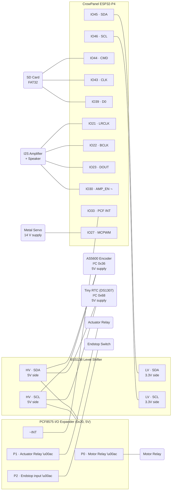

# Digital Charpy Impact Testing Machine

Firmware for a digital Charpy impact testing machine built on the **CrowPanel ESP32-P4** (9" IPS touchscreen). Measures absorbed energy during a Charpy V-notch impact test by tracking pendulum swing angle with a magnetic encoder.

## Hardware

| Component | Interface | Details |
|---|---|---|
| CrowPanel ESP32-P4 | — | 9" 1024×600 IPS, MIPI DSI (EK79007), GT911 touch |
| AS5600 Magnetic Encoder | I2C (0x36) | 12-bit angle, **5V supply**, HV side of level shifter |
| BSS138 Level Shifter | I2C | Bidirectional 3.3V ↔ 5V on SDA/SCL; LV side to ESP32, HV side to 5V devices |
| Tiny RTC (DS1307) | I2C (0x68) | Battery-backed, CR2032 coin cell, **5V supply**, HV side of level shifter |
| PCF8575 I/O Expander | I2C (0x20) | 16-bit quasi-bidirectional; **5V supply**, HV side of level shifter; INT → GPIO33 |
| SD Card | SDMMC 1-line | IO44 CMD, IO43 CLK, IO39 D0, FAT32 |
| Speaker + Amplifier | I2S1 | 16kHz/16-bit, amp on IO30 (active-low) |
| Motor Relay | PCF8575 P0 | Lifts pendulum arm (active-low) |
| Actuator Relay | PCF8575 P1 | Releases pendulum latch (active-low) |
| Endstop Switch | PCF8575 P2 | Detects arm at top position (active-low input; triggers PCF8575 INT) |
| Metal Servo (14 V) | MCPWM / GPIO27 | 50 Hz PWM signal (3.3 V logic), motor power from dedicated 14 V supply |



> **Note:** The PCF8575, AS5600, and Tiny RTC are all **5V** devices on the HV side of the level shifter. IO45/IO46 (3.3V, LV side) is the only I2C connection to the ESP32. GPIO47 and GPIO48 are now free. PCF8575 P3–P15 are reserved for future expansion. `¬` = active-low. The servo runs from a separate 14 V rail; only GND and the 3.3 V PWM signal (IO27, 470 Ω series resistor recommended) connect to the ESP32.

## Wiring

### AS5600 Magnetic Encoder

The AS5600 exposes 7 pins. **Only 5 connections are required** for I²C operation — `PROG` and `OUT` are not used.

| Pin | Name | Required? | Connect to |
|-----|------|-----------|------------|
| VDD | Power supply | ✅ Yes | 5 V (HV side of level shifter) |
| GND | Ground | ✅ Yes | Common GND |
| DIR | Direction select | ✅ Yes (tie) | GND = counter-clockwise · VDD = clockwise — **no MCU GPIO needed** |
| SDA | I²C data | ✅ Yes | Level shifter HV SDA |
| SCL | I²C clock | ✅ Yes | Level shifter HV SCL |
| PROG | OTP programming | ❌ No | Leave unconnected |
| OUT | Analog / PWM output | ❌ No | Leave unconnected (I²C mode used) |

> **DIR note:** This pin simply sets the counting direction of the internal angle register. Tie it to GND or VDD with a short wire — it does not need to connect to the ESP32.

### Level Shifter (BSS138 / HX2 module)

| Level shifter pin | Connect to |
|-------------------|------------|
| LV | 3.3 V (ESP32 supply) |
| HV | 5 V supply |
| GND | Common GND |
| LV–SDA | IO45 (ESP32) |
| LV–SCL | IO46 (ESP32) |
| HV–SDA | AS5600 SDA · DS1307 SDA · PCF8575 SDA |
| HV–SCL | AS5600 SCL · DS1307 SCL · PCF8575 SCL |

### Brake Servo

| Servo wire | Connect to |
|------------|------------|
| Signal (orange/yellow) | IO27 (470 Ω series resistor recommended) |
| VCC (red) | Dedicated 14 V supply |
| GND (black/brown) | Common GND shared with ESP32 |

### SD Card (SDMMC 1-line mode)

| SD pin | ESP32 GPIO |
|--------|------------|
| CMD | IO44 |
| CLK | IO43 |
| D0 | IO39 |
| VCC | 3.3 V |
| GND | GND |

## Software Stack

- **ESP-IDF** 5.4.3
- **LVGL** 9.2.2 (via `esp_lvgl_port`)
- **FreeRTOS** (SMP on dual-core RISC-V)
- NVS for persistent configuration
- FAT32 on SD card for CSV data logging

## Project Structure

```
├── CMakeLists.txt              # Top-level build config
├── partitions.csv              # Partition table
├── sdkconfig                   # ESP-IDF configuration
├── main/
│   ├── CMakeLists.txt          # Main component build config
│   ├── main.c                  # App entry: init, FreeRTOS tasks
│   ├── test_manager.c          # Test state machine
│   ├── audio_manager.c         # Non-blocking audio playback task
│   ├── data_logger.c           # CSV logging to SD card
│   ├── include/
│   │   ├── main.h              # System includes and log macros
│   │   ├── charpy_calc.h       # Energy calculation (header-only)
│   │   ├── test_manager.h      # Test state machine API
│   │   ├── audio_manager.h     # Audio manager API
│   │   └── data_logger.h       # Data logger API
│   └── ui/
│       ├── ui.h                # UI master header (colors, styles, externs)
│       ├── ui.c                # Theme, styles, status bar, navigation
│       ├── ui_dashboard.c      # Dashboard screen (live angle + last result)
│       ├── ui_specimen.c       # Specimen entry form
│       ├── ui_test_active.c    # Active test screen (state-driven)
│       ├── ui_history.c        # Test history table with pagination
│       ├── ui_settings.c       # Settings (6 tabbed panels)
│       └── ui_dbtt.c           # DBTT analysis screen (bar chart + table)
├── peripheral/
│   ├── bsp_angle/              # AS5600 I2C driver
│   ├── bsp_rtc/                # DS3231 I2C driver
│   ├── bsp_sdcard/             # SD card FAT32 driver
│   ├── bsp_audio/              # I2S audio WAV playback
│   ├── bsp_extra/              # Relay, endstop, LED GPIO control
│   ├── bsp_display/            # LCD + LVGL display init (CrowPanel)
│   ├── bsp_i2c/                # Shared I2C bus management
│   └── bsp_illuminate/         # Backlight PWM control
└── managed_components/         # ESP Component Registry packages
    ├── lvgl__lvgl/
    └── espressif__esp_lvgl_port/
```

## Test Workflow

1. **Dashboard** — Shows live angle gauge and last test result
2. **New Test** — Enter specimen ID, operator, material, dimensions
3. **Arming** — Motor lifts pendulum to release position, endstop triggers when arm reaches top
4. **Armed** — Operator presses "RELEASE" on touchscreen
5. **Measuring** — High-speed angle sampling (~1kHz) until pendulum settles (±0.5° for 500ms)
6. **Complete** — Displays final angle and absorbed energy. Save or discard result.

## Energy Calculation

$$E = m \cdot g \cdot L \cdot (\cos\beta - \cos\alpha)$$

Where:
- $m$ = pendulum mass (kg), default 3.950 kg
- $g$ = 9.80665 m/s²
- $L$ = arm length (m), default 0.400 m
- $\alpha$ = release angle (°)
- $\beta$ = final (post-impact) angle (°)

Configuration is stored in NVS and editable via Settings screen.

## Data Logging

Test results are logged as CSV to the SD card in daily files:

```
/sdcard/CHARPY_20260420.csv
```

CSV columns: `timestamp, specimen_id, material, width_mm, height_mm, length_mm, operator, release_angle, final_angle, energy_joules, notes`

## Audio Notifications

Place WAV files (16kHz, 16-bit, mono PCM) in `/sdcard/sounds/`:

| Event | File |
|---|---|
| Arm reached top | `armed.wav` |
| Pendulum released | `released.wav` |
| Test complete | `complete.wav` |
| Test aborted | `abort.wav` |
| Error occurred | `error.wav` |

Audio plays asynchronously via a dedicated FreeRTOS task — never blocks the test state machine or UI.

## UI Theme

Dark industrial theme optimized for lab/workshop visibility:

| Element | Color |
|---|---|
| Background | `#1A1A2E` |
| Surface | `#16213E` |
| Primary (cyan) | `#00D4FF` |
| Danger (red) | `#E94560` |
| Success (green) | `#00E676` |
| Warning (amber) | `#FFC107` |
| Text | `#EAEAEA` |

Fonts: Montserrat 48px (results), 28px (headings), 20px (body), 16px (status/captions).

## UI Screens

All screens share a **status bar** (40 px, top of every screen) showing:
- Left: status dot (green = idle/ok, amber = busy, red = error) + "CHARPY TESTER" title
- Centre: machine state badge (`IDLE` / `ARMING` / `ARMED` / `MEASURING` / `COMPLETE` / `ERROR`)
- Right: live time, date (from DS1307 RTC), and SD card status icon

Screens use a `LV_SCR_LOAD_ANIM_FADE_IN` transition (200 ms) when switching.

---

### Dashboard (`scr_dashboard`)

The home screen, loaded at startup.

| Area | Content |
|---|---|
| Left half | 320×320 arc gauge — live pendulum angle (0–360°, cyan indicator, 48 px font). Updated at ~10 Hz from the angle task. |
| Right half | **Last Test Result** card — angle (°) and energy (J) in large highlighted boxes; below: Specimen ID, Material, Operator, timestamp |
| Bottom nav | **NEW TEST** (primary), **HISTORY**, **DBTT**, **SETTINGS** |

---

### Specimen Entry (`scr_specimen`)

Reached via "NEW TEST" on the Dashboard.

Collects all metadata before a test run:

| Field | Type | Notes |
|---|---|---|
| Specimen ID | Text area | Free text, e.g. `STEEL-043` |
| Operator | Text area | Free text, e.g. `J. Reyes` |
| Material | Dropdown | Mild Steel / Stainless Steel / Aluminum / Copper / Plastic / Custom |
| Width × Height × Length | Numeric text areas | mm, accepts `0–9` and `.` only |
| Temperature | Numeric text area | °C |
| Notes | Multi-line text area | Optional |

An LVGL on-screen keyboard slides up automatically when a text area is focused and hides on "OK". Tapping **ARM & START** copies the form data into a `specimen_info_t`, calls `test_manager_arm()`, and navigates to the Test Active screen. A **Back** button returns to Dashboard without starting a test.

---

### Test Active (`scr_test_active`)

The main operational screen — state-driven. The arc gauge indicator colour changes with each stage.

| Stage | Arc colour | Progress dots | Message |
|---|---|---|---|
| ARMING | Amber | 1 / 4 filled | "ARMING – Lifting arm… Stand clear." |
| ARMED | Green | 2 / 4 filled | "ARMED – Ready. Press RELEASE when ready." |
| RELEASED / MEASURING | Cyan | 3 / 4 filled | "MEASURING – Recording swing…" |
| COMPLETE | Green | 4 / 4 filled | "COMPLETE – Test finished." |
| ERROR | Red | — | Error description |

**Button visibility by stage:**

| Stage | Visible buttons |
|---|---|
| ARMING | ABORT TEST |
| ARMED | RELEASE ARM (large, red) + ABORT TEST |
| MEASURING | ABORT TEST |
| COMPLETE | SAVE RESULT (green) + DISCARD (danger outline) |

When COMPLETE, a **result panel** appears showing the measured angle (°) and calculated energy (J) before the operator decides to save or discard.

---

### History (`scr_history`)

Reached via "HISTORY" on the Dashboard. Displays all saved test records loaded from `data_logger` (in-memory ring buffer, newest first).

| Column | Content |
|---|---|
| Date/Time | ISO timestamp from RTC |
| Specimen | Specimen ID |
| Material | Material type |
| Angle (°) | Final swing angle |
| Energy (J) | Calculated absorbed energy |
| Status | `OK` or `--` |

Shows 10 rows per page with **Prev / Next** pagination and a record count in the header. A **Back** button returns to Dashboard.

---

### Settings (`scr_settings`)

Reached via "SETTINGS" on the Dashboard. Uses a **sidebar + content panel** layout with 6 tabs:

| Tab | Contents |
|---|---|
| **Pendulum** | Hammer mass (kg), arm length (m), release angle (°). Saved to NVS on "Save Config". |
| **Calibration** | Single-button zero calibration — positions the AS5600 encoder's zero-reference to the current physical position. Displays the resulting offset angle. |
| **Date & Time** | Reads and displays the current DS1307 RTC date/time. (Setting requires serial or a pre-set RTC module.) |
| **SD Card** | Mount status; total and free capacity in MB when mounted. |
| **Audio** | Toggle switch to enable/disable sound notifications. |
| **About** | Firmware version and hardware info. |

An on-screen keyboard is shared across all numeric text areas in this screen.

---

### DBTT Analysis (`scr_dbtt`)

Reached via **DBTT** on the Dashboard. Performs a Ductile-to-Brittle Transition Temperature analysis by aggregating all saved test results grouped by specimen temperature.

**Chart — N of Tests vs. Temperature**

- Type: vertical bar chart (`LV_CHART_TYPE_BAR`)
- X axis: distinct test temperatures (°C), sorted ascending, labels shown below the chart
- Y axis: N — number of tests performed at each temperature
- 5 horizontal grid lines for visual reference
- Up to 20 distinct temperature points (`DBTT_MAX_TEMPS`)
- Only results with a valid absorbed energy (> 0 J) are included
- A **Refresh** button re-aggregates the current history on demand (data is also refreshed automatically when the screen is loaded)

**Data table** (below chart)

| Column | Content |
|---|---|
| Temp (°C) | Test temperature, sorted ascending |
| N | Number of tests at this temperature |
| Avg Energy (J) | Mean absorbed energy |
| Min (J) | Minimum absorbed energy recorded |
| Max (J) | Maximum absorbed energy recorded |

> **Workflow tip:** Run at least 3 Charpy tests at each desired temperature. The N column in the table and the bar height show where more samples are needed. Once enough data is collected the transition region becomes visible as the temperatures where avg energy drops sharply.

---

## Thread Safety

- All LVGL calls from background tasks are wrapped in `lvgl_port_lock()` / `lvgl_port_unlock()`
- The `ui_update_task` acquires the LVGL mutex before updating any widget
- State change callbacks from `test_manager` also acquire the lock
- The angle sampling task writes to `live_angle` (atomic float read on ESP32-P4)

## Building

Requires ESP-IDF 5.4.3 with ESP32-P4 target:

```bash
idf.py set-target esp32p4
idf.py build
idf.py flash monitor
```

## Configuration

Default pendulum parameters (editable in Settings):

| Parameter | Default | NVS Key |
|---|---|---|
| Hammer mass | 3.950 kg | `mass` |
| Arm length | 0.400 m | `arm_len` |
| Release angle | 150.0° | `rel_ang` |
| Zero offset | 0 (raw) | `zero_off` |
| Brake servo target | 90.0° | `brake_ang` |
