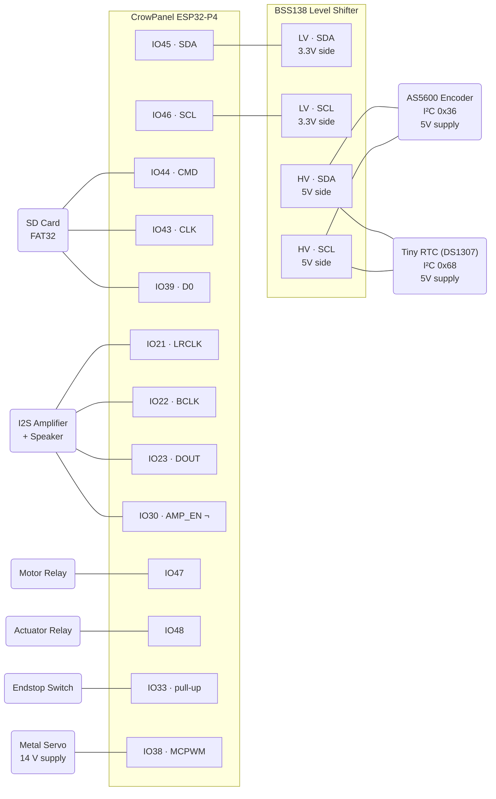

# Digital Charpy Impact Testing Machine

Firmware for a digital Charpy impact testing machine built on the **CrowPanel ESP32-P4** (9" IPS touchscreen). Measures absorbed energy during a Charpy V-notch impact test by tracking pendulum swing angle with a magnetic encoder.

## Hardware

| Component | Interface | Details |
|---|---|---|
| CrowPanel ESP32-P4 | — | 9" 1024×600 IPS, MIPI DSI (EK79007), GT911 touch |
| AS5600 Magnetic Encoder | I2C (0x36) | 12-bit angle, **5V supply**, HV side of level shifter |
| BSS138 Level Shifter | I2C | Bidirectional 3.3V ↔ 5V on SDA/SCL; LV side to ESP32, HV side to AS5600 |
| Tiny RTC (DS1307) | I2C (0x68) | Battery-backed, CR2032 coin cell, **5V supply**, HV side of level shifter |
| SD Card | SDMMC 1-line | IO44 CMD, IO43 CLK, IO39 D0, FAT32 |
| Speaker + Amplifier | I2S1 | 16kHz/16-bit, amp on IO30 (active-low) |
| Motor Relay | GPIO47 | Lifts pendulum arm |
| Actuator Relay | GPIO48 | Releases pendulum latch |
| Endstop Switch | GPIO33 | Detects arm at top position (pull-up, debounced) |
| Metal Servo (14 V) | MCPWM / GPIO38 | 50 Hz PWM signal (3.3 V logic), motor power from dedicated 14 V supply |



> **Note:** Both the AS5600 and Tiny RTC (DS1307) are 5V devices and share the HV side of the BSS138 level shifter. The ESP32 I2C bus (IO45/IO46, 3.3V) connects to the LV side. The metal servo runs from a **separate 14 V supply** — only GND and the 3.3 V PWM signal (IO38, 470 Ω series resistor recommended) connect to the ESP32. `¬` = active-low. `pull-up` = internal pull-up, active-low signal.

## Software Stack

- **ESP-IDF** 5.4.3
- **LVGL** 9.2.2 (via `esp_lvgl_port`)
- **FreeRTOS** (SMP on dual-core RISC-V)
- NVS for persistent configuration
- FAT32 on SD card for CSV data logging

## Project Structure

```
├── CMakeLists.txt              # Top-level build config
├── partitions.csv              # Partition table
├── sdkconfig                   # ESP-IDF configuration
├── main/
│   ├── CMakeLists.txt          # Main component build config
│   ├── main.c                  # App entry: init, FreeRTOS tasks
│   ├── test_manager.c          # Test state machine
│   ├── audio_manager.c         # Non-blocking audio playback task
│   ├── data_logger.c           # CSV logging to SD card
│   ├── include/
│   │   ├── main.h              # System includes and log macros
│   │   ├── charpy_calc.h       # Energy calculation (header-only)
│   │   ├── test_manager.h      # Test state machine API
│   │   ├── audio_manager.h     # Audio manager API
│   │   └── data_logger.h       # Data logger API
│   └── ui/
│       ├── ui.h                # UI master header (colors, styles, externs)
│       ├── ui.c                # Theme, styles, status bar, navigation
│       ├── ui_dashboard.c      # Dashboard screen (live angle + last result)
│       ├── ui_specimen.c       # Specimen entry form
│       ├── ui_test_active.c    # Active test screen (state-driven)
│       ├── ui_history.c        # Test history table with pagination
│       └── ui_settings.c       # Settings (6 tabbed panels)
├── peripheral/
│   ├── bsp_angle/              # AS5600 I2C driver
│   ├── bsp_rtc/                # DS3231 I2C driver
│   ├── bsp_sdcard/             # SD card FAT32 driver
│   ├── bsp_audio/              # I2S audio WAV playback
│   ├── bsp_extra/              # Relay, endstop, LED GPIO control
│   ├── bsp_display/            # LCD + LVGL display init (CrowPanel)
│   ├── bsp_i2c/                # Shared I2C bus management
│   └── bsp_illuminate/         # Backlight PWM control
└── managed_components/         # ESP Component Registry packages
    ├── lvgl__lvgl/
    └── espressif__esp_lvgl_port/
```

## Test Workflow

1. **Dashboard** — Shows live angle gauge and last test result
2. **New Test** — Enter specimen ID, operator, material, dimensions
3. **Arming** — Motor lifts pendulum to release position, endstop triggers when arm reaches top
4. **Armed** — Operator presses "RELEASE" on touchscreen
5. **Measuring** — High-speed angle sampling (~1kHz) until pendulum settles (±0.5° for 500ms)
6. **Complete** — Displays final angle and absorbed energy. Save or discard result.

## Energy Calculation

$$E = m \cdot g \cdot L \cdot (\cos\beta - \cos\alpha)$$

Where:
- $m$ = pendulum mass (kg), default 3.950 kg
- $g$ = 9.80665 m/s²
- $L$ = arm length (m), default 0.400 m
- $\alpha$ = release angle (°)
- $\beta$ = final (post-impact) angle (°)

Configuration is stored in NVS and editable via Settings screen.

## Data Logging

Test results are logged as CSV to the SD card in daily files:

```
/sdcard/CHARPY_20260420.csv
```

CSV columns: `timestamp, specimen_id, material, width_mm, height_mm, length_mm, operator, release_angle, final_angle, energy_joules, notes`

## Audio Notifications

Place WAV files (16kHz, 16-bit, mono PCM) in `/sdcard/sounds/`:

| Event | File |
|---|---|
| Arm reached top | `armed.wav` |
| Pendulum released | `released.wav` |
| Test complete | `complete.wav` |
| Test aborted | `abort.wav` |
| Error occurred | `error.wav` |

Audio plays asynchronously via a dedicated FreeRTOS task — never blocks the test state machine or UI.

## UI Theme

Dark industrial theme optimized for lab/workshop visibility:

| Element | Color |
|---|---|
| Background | `#1A1A2E` |
| Surface | `#16213E` |
| Primary (cyan) | `#00D4FF` |
| Danger (red) | `#E94560` |
| Success (green) | `#00E676` |
| Warning (amber) | `#FFC107` |
| Text | `#EAEAEA` |

Fonts: Montserrat 48px (results), 28px (headings), 20px (body), 16px (status/captions).

## Thread Safety

- All LVGL calls from background tasks are wrapped in `lvgl_port_lock()` / `lvgl_port_unlock()`
- The `ui_update_task` acquires the LVGL mutex before updating any widget
- State change callbacks from `test_manager` also acquire the lock
- The angle sampling task writes to `live_angle` (atomic float read on ESP32-P4)

## Building

Requires ESP-IDF 5.4.3 with ESP32-P4 target:

```bash
idf.py set-target esp32p4
idf.py build
idf.py flash monitor
```

## Configuration

Default pendulum parameters (editable in Settings):

| Parameter | Default | NVS Key |
|---|---|---|
| Hammer mass | 3.950 kg | `mass` |
| Arm length | 0.400 m | `arm_len` |
| Release angle | 150.0° | `rel_ang` |
| Zero offset | 0 (raw) | `zero_off` |
